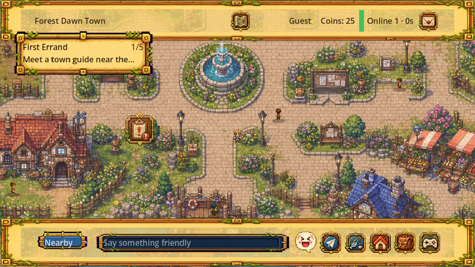
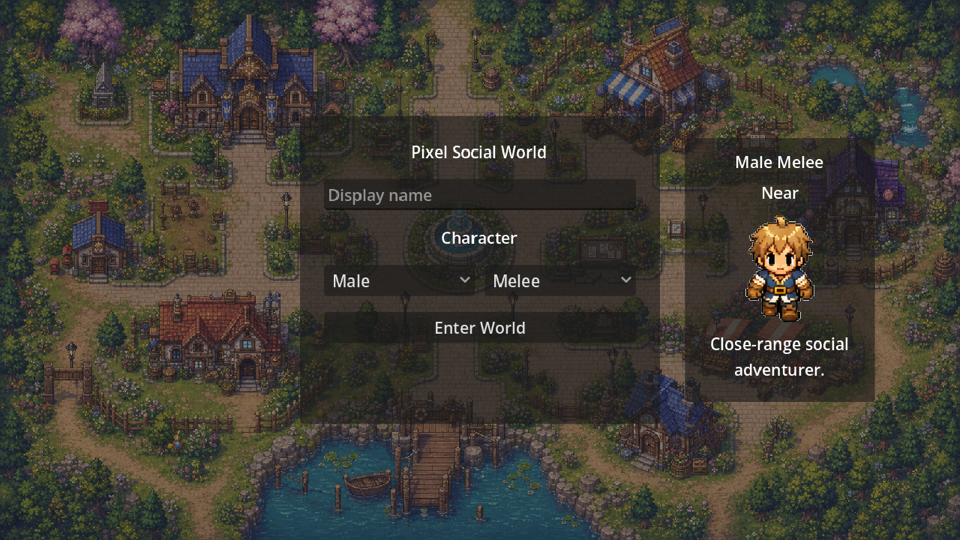
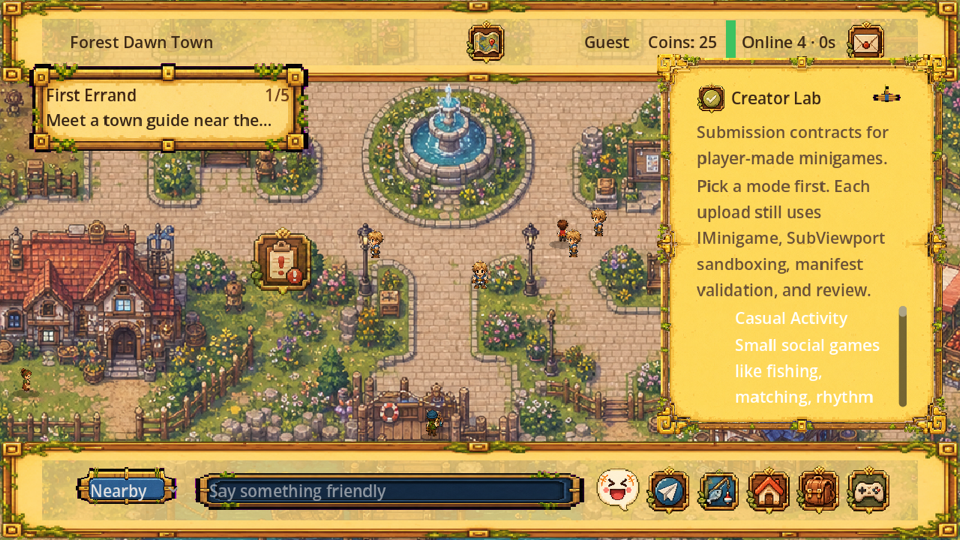
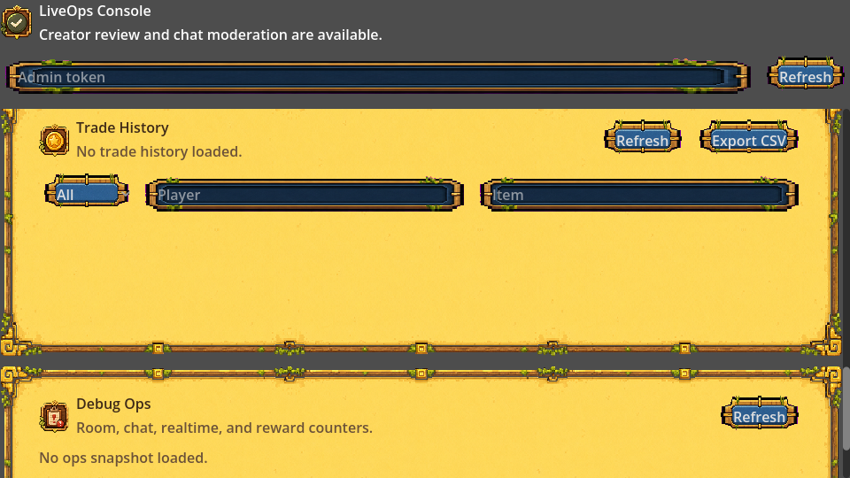
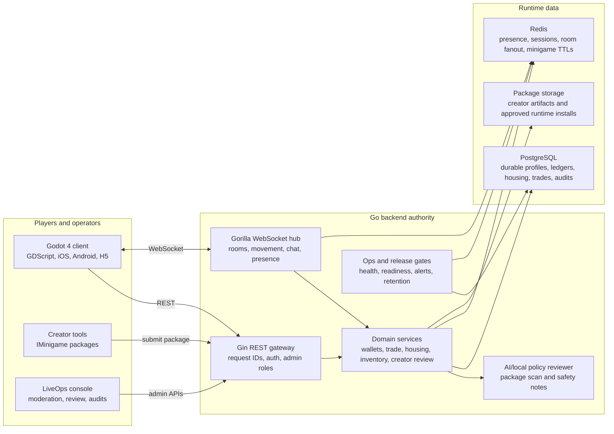

# Pixel Social World

[](https://github.com/xnrpnsck2x-creator/pixel-social-world/actions/workflows/release-readiness.yml)

Pixel Social World is a 2D pixel online social world built around a warm forest main city, housing, chat, live operations, economy systems, and a creator minigame platform. The long-term goal is a social MMO-like space where players can publish AI-assisted minigames through a stable `IMinigame` contract.

Current status: public alpha preparation. The repository is being opened for project visibility and release readiness review; production credentials, signing keys, and deployment secrets are intentionally not committed.

## Project Preview

| Main city | Character selection |
| --- | --- |
|  |  |

| Creator Lab | LiveOps console |
| --- | --- |
|  |  |

## Stack

- Client: Godot 4.x, GDScript only
- Backend: Go service authority with Gin REST APIs, Gorilla WebSocket realtime sync, GORM persistence, and modular domain packages
- Runtime data: PostgreSQL for durable storage and audits, Redis for presence, room fanout, auth/session TTLs, and minigame session state
- Target platforms: iOS, Android, H5/Web, later PC
- Languages: English, Japanese, Simplified Chinese

## Why The Go Backend Matters

The Go backend is the backbone of the online world, not a thin companion API. It is designed as the server-authoritative layer that keeps social play, economy, creator content, and LiveOps safe enough to run beyond a local prototype.

- Realtime at the center: WebSocket room joins, movement sync, chat broadcast, house visits, minigame sessions, Redis-backed presence, and Redis fanout are built for many concurrent players without pushing concurrency complexity into the Godot client.
- Economy-safe by design: wallets, reward grants, spending, creator-share payouts, trade listings, trade settlement, escrow inventory, daily reward caps, and append-only ledger history are handled server-side so the client cannot become the source of truth for coins or items.
- Creator-platform ready: minigame package intake, scan snapshots, AI/local-policy review, reviewer dashboards, publish/rollback state, and runtime-safe catalog output make player-created content reviewable before it reaches the live catalog.
- LiveOps and moderation aware: chat reports, profile reports, mute/ban/restore actions, admin roles, action audit streams, CSV exports, request IDs, structured access logs, and `/debug/ops` counters give operators enough visibility to handle public-alpha incidents.
- Production-shaped from day one: the backend builds into a Go binary for Linux amd64, runs under systemd, supports `/healthz` and `/readyz`, keeps secrets in environment files, and has release gates for monitoring, backup, auth providers, iOS, and Android handoff.
- Single-host efficient, horizontally aware: the MVP starts cleanly on one Ubuntu host with PostgreSQL and Redis, while the room and realtime contracts leave room for multi-process fanout as traffic grows.

## System Architecture



The client stays lightweight and expressive, while the Go backend owns trust, concurrency, review, persistence, and public-alpha operations.

## What Is In The MVP

- Main city scene with movement, NPCs, map points, chat, inventory, mail, trade, guild, creator, and LiveOps panels
- Official fishing minigame and creator minigame contract examples
- Guest auth and Apple/Google upgrade contracts
- Economy ledger, inventory, housing, social facility, moderation, and audit flows
- Image 2 generated map, UI, character, branding, and store artwork assets under `assets/`
- Store handoff runbooks for iOS, Android, production monitoring, auth providers, and data backup

## Quick Start

Backend tests:

```bash
cd backend
go test ./...
```

Run the backend locally in memory mode:

```bash
cd backend
GIN_MODE=release go run ./cmd/server
```

Open the Godot client with Godot 4.x:

```bash
godot --path .
```

This workspace also supports project-local toolchains under `.tools/` during local development, but `.tools/` is intentionally ignored and not part of the public repository.

## Verification

The GitHub Actions release-readiness workflow runs:

- Go format and backend unit tests
- Content and localization contract validation
- Secret hygiene and tracked file size guards
- GDScript 300-line budget
- Release handoff contracts for store auth, monitoring, backup, iOS, and Android

The deeper local gate is still available for full H5/Godot screenshot and semantic smoke coverage:

```bash
scripts/run_mvp_100_gate.sh
```

## Repository Map

- `assets/` - official generated pixel art, UI, branding, and map assets
- `backend/` - Go API, realtime, economy, house, inventory, trade, moderation, and deployment code
- `configs/` - client/runtime JSON configuration
- `docs/` - architecture, contracts, roadmap, store handoff, and production runbooks
- `localization/` - English, Japanese, and Simplified Chinese strings
- `scenes/` - Godot scenes
- `scripts/` - local gates, export helpers, and release readiness checks
- `tests/` - content validators, Godot smoke tests, H5 semantic tests, and backend E2E scripts

## Security And Secrets

Do not commit production secrets. Use environment variables or `/etc/pixel-social-world/backend.env` for deployment configuration. The repository intentionally keeps these external:

- App Store Connect keys and provisioning profiles
- Google Play service account JSON and Android release keystores
- `PSW_ADMIN_TOKEN`, PostgreSQL DSNs, Redis passwords, and LiveOps alert tokens
- OpenAI-compatible reviewer API keys

Run the local secret check before publishing changes:

```bash
python3 scripts/check_secret_hygiene.py
```

See `SECURITY.md` for vulnerability reporting and safe testing guidelines.

## Creator Minigame Contract

Creator games must inherit the Godot `IMinigame` interface and provide localized metadata. Runtime-loaded games are isolated through the minigame sandbox flow, and creator submissions are reviewed before listing.

See:

- `docs/CreatorMinigameSpec.md`
- `docs/BackendContract.md`
- `scripts/minigame/IMinigame.gd`

## License

Apache License 2.0. See `LICENSE`.

SPDX-License-Identifier: Apache-2.0

Project copyright: Copyright 2026 xnrpnsck2x-creator. Third-party dependencies remain under their own licenses.

See `CONTRIBUTING.md` for contribution workflow and PR expectations.
