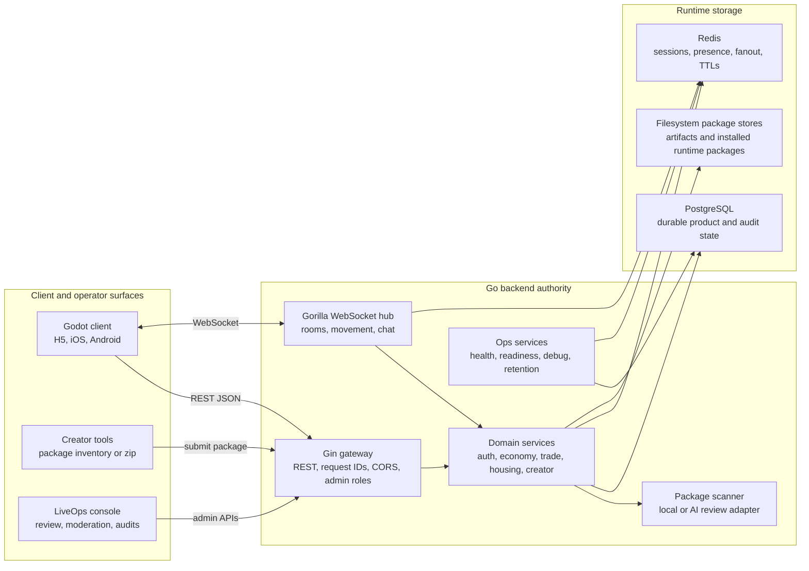
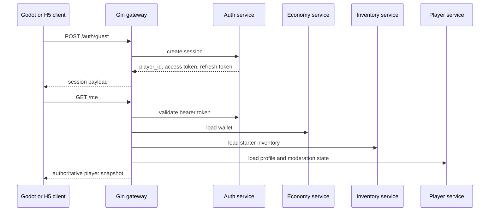
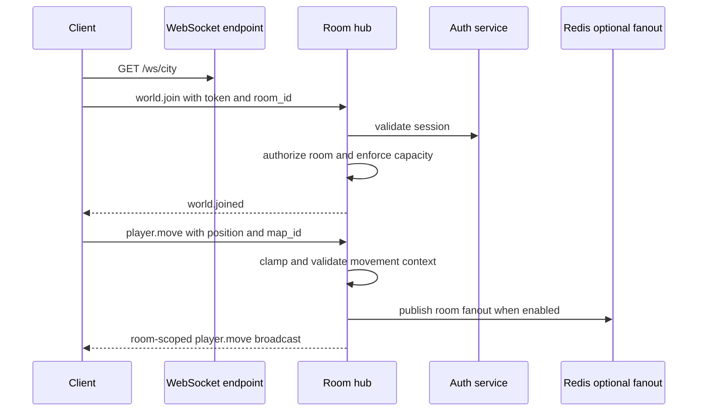
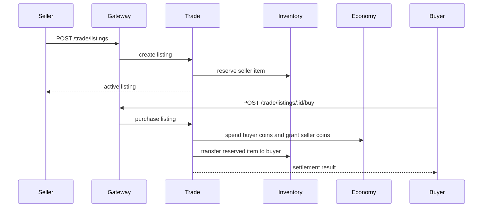
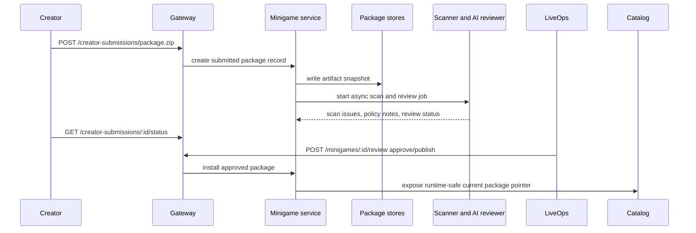
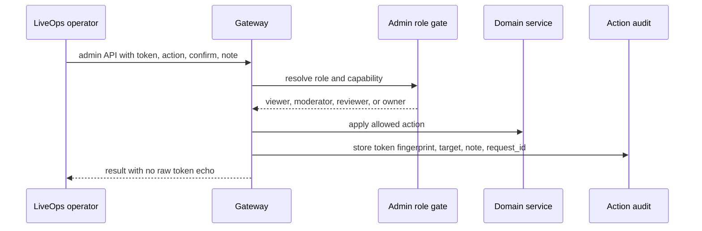

# Backend Architecture

Status: Public Alpha architecture baseline

Date: 2026-06-11

This document describes the Go backend as the production authority for Pixel
Social World. The Godot client is responsible for input, presentation, local
fallbacks, and sandboxed minigame runtime. The backend is responsible for trust,
concurrency, persistence, economy, creator review, LiveOps, and release
readiness.

## Goals

- Keep online state server-authoritative for auth, movement context, rewards,
  spending, trading, housing, creator packages, and admin actions.
- Let local development stay fast through memory services while preserving the
  same HTTP and WebSocket contracts used in public alpha.
- Run the first production deployment as a Linux amd64 Go binary with
  PostgreSQL, Redis, systemd, preflight checks, retention cleanup, and
  environment-file secrets.
- Support the long-term creator ecosystem: packages are accepted through a
  stable contract, scanned, reviewed, approved, installed, and exposed only
  through a runtime-safe catalog.
- Keep the single-developer workflow practical: each backend slice has unit
  tests, config-first contracts, and release gates that can run locally or in CI.

## Non-Goals

- The backend does not render scenes, choose sprites, or own Godot UI layout.
- Creator packages are not executed directly by the backend.
- Memory mode is not a production data store.
- Admin APIs are not public player APIs, even when they are used by Godot or H5
  operator panels.
- The first public alpha does not require Kubernetes, service mesh, or a
  multi-region topology.

## Runtime Topology

## Code Map

| Area | Main packages | Responsibility |
| --- | --- | --- |
| Entry and wiring | `cmd/server`, `internal/config`, `internal/gateway` | Load config, choose memory/Postgres/Redis services, register routes, run HTTP server, handle graceful shutdown. |
| Auth and account upgrade | `internal/auth`, `internal/player` | Guest auth, refresh tokens, Apple/Google upgrade contracts, optional strict OIDC verification, player profile state. |
| Realtime city | `internal/room`, `internal/presence` | WebSocket joins, room capacity, room authorization, movement envelope validation, chat fanout, presence TTLs, Redis fanout and rate limits. |
| Chat and messaging | `internal/chat`, `internal/messaging` | Room chat, chat reports, moderation actions, private messages, mailbox, durable report and read-marker records. |
| Economy and items | `internal/economy`, `internal/inventory`, `internal/trade` | Wallets, ledger, reward caps, creator-share payouts, inventory reservation, listings, buy/cancel settlement, trade audits. |
| Housing and social | `internal/house`, `internal/social`, `internal/facility` | House layout, placement rules, invites, visits, follow/block state, social facilities. |
| Creator platform | `internal/minigame`, `pkg/ai` | Package intake, zip extraction, package scanner, review jobs, AI/local policy adapter, approval, publish, rollback, runtime catalog, minigame sessions. |
| Utility and maps | `internal/utility`, `internal/mapactivity` | Main-city shop/mail/notice registry, map discovery, map activities, rewards, cooldowns, daily fatigue. |
| Operations | `internal/ops`, `backend/deploy`, `cmd/preflight`, `cmd/retention-cleanup` | Health/readiness, debug ops, LiveOps alerts, production preflight, retention cleanup, systemd handoff. |
| Shared clients | `pkg/db`, `pkg/redis` | PostgreSQL and Redis client setup for production modes. |

## API Surface

The full wire contract lives in `docs/BackendContract.md`. This section groups
the public shape by product flow so implementation and QA can reason about
ownership.

| Product flow | Routes and protocols |
| --- | --- |
| Liveness and readiness | `GET /healthz`, `GET /readyz` |
| Runtime operations | `GET /debug/rooms`, `GET /debug/ops`, `GET /debug/ops/alerts` |
| Auth and account | `POST /auth/guest`, `POST /auth/refresh`, `POST /auth/upgrade`, `GET /me` |
| Realtime world | `GET /city/state`, `GET /ws/city`, `POST /presence/heartbeat`, `GET /rooms/:room_id/members` |
| Chat and reports | `POST /chat/send`, `GET /chat/history/:room_id/:channel_id`, `POST /chat/report`, `POST /players/report` |
| Private social messaging | `POST /private-messages`, `GET /private-messages`, `GET /private-messages/:peer_id`, `POST /private-messages/read/:peer_id`, `POST /private-messages/report`, `POST /mailbox/send`, `GET /mailbox/inbox`, `POST /mailbox/:mail_id/read` |
| Social graph and facilities | `GET /social/state/:target_player_id`, `GET /social/following`, `POST /social/follow`, `POST /social/unfollow`, `POST /social/block`, `POST /social/unblock`, `GET /social/facilities`, `GET /social/facilities/:id` |
| Maps and activities | `GET /players/maps/discovered`, `POST /players/maps/discovered`, `POST /players/maps/discovered/sync`, `POST /map-activities/claim` |
| Economy and inventory | `POST /economy/reward`, `POST /economy/first-session/claim`, `GET /economy/policy`, `POST /economy/creator-share`, `POST /economy/spend`, `GET /economy/ledger/:player_id`, `GET /inventory` |
| Trade | `GET /trade/listings`, `GET /trade/history`, `GET /trade/inventory`, `POST /trade/listings`, `POST /trade/listings/:id/buy`, `POST /trade/listings/:id/cancel` |
| Housing | `GET /housing/layout/:owner_id`, `POST /housing/invite`, `POST /housing/visit`, `POST /housing/place`, `POST /housing/style`, `POST /housing/move`, `POST /housing/remove` |
| Creator platform | `POST /creator-submissions/draft`, `POST /creator-submissions/package`, `POST /creator-submissions/package.zip`, `GET /creator-submissions/:id/status`, `GET /creator-submissions/:id/history`, `POST /minigames/submit`, `GET /minigames/catalog`, `GET /minigames/:id`, `POST /minigames/:id/review` |
| Minigame sessions | `POST /minigame-sessions`, `GET /minigame-sessions/:room_id`, `POST /minigame-sessions/:session_id/join`, `POST /minigame-sessions/:session_id/leave`, `POST /minigame-sessions/:session_id/end`, `POST /minigames/fishing/catch` |
| LiveOps admin | `GET /admin/session`, `GET /admin/reviewer-dashboard`, `GET /admin/reviewer-audit/:id`, `GET /admin/chat-reports`, `POST /admin/chat-reports/:id/review`, `GET /admin/chat-moderation/actions`, `POST /admin/chat-moderation/actions`, `GET /admin/action-audit`, `GET /admin/inventory/audit`, `GET /admin/economy/creator-payouts`, `GET /admin/trade/history`, `PUT /admin/utility/panels`, `POST /admin/players/maps/discovered` |
| Utility panels | `GET /utility/panels`, `GET /utility/shop`, `GET /utility/mail`, `GET /utility/notices` |

## Request Flow: Online Entry

The client can keep offline fallback data for iteration, but the online session
starts from the Go backend snapshot.

## Request Flow: Realtime Room

Movement, map context, room membership, failed writes, and dense-room culling
are backend-observed so LiveOps can react to public-alpha load issues.

## Request Flow: Trade Escrow

The client may display prices and listing cards, but the Go backend owns escrow,
coin movement, item transfer, event history, and inactive listing protection.

## Request Flow: Creator Package Review

Creator packages are not trusted because they come from players. The backend
rejects path traversal, duplicate files, unsupported script or native file
types, formal SVG assets, missing script text, forbidden Godot APIs, and
packages over the configured asset budget before a package can reach review.

## Request Flow: LiveOps Action

High-risk actions require explicit confirmation and notes. Raw admin tokens are
not echoed in responses or audit rows.

## Storage Modes

| Mode | Purpose | Production use |
| --- | --- | --- |
| `memory` storage | Fast local iteration, no external services, deterministic unit tests. | Not production. |
| `postgres` storage | Durable product state and audit records: chat/report moderation, private messages, economy ledger, housing, minigames, social graph, player map discovery, utility panels, inventory, trade, and map activity claims. | Required for public alpha. |
| `redis` realtime | Auth session TTLs, presence TTLs, minigame session TTLs, realtime fanout, and rate limits. | Required for multi-process or production-like realtime behavior. |
| Filesystem package stores | Creator package artifacts and installed runtime packages under configured directories. | Required until S3-compatible storage is added. Back up together with PostgreSQL. |

The backend keeps the same route contract across modes. Mode selection changes
service implementations, not client behavior.

## Trust Boundaries

- Client requests are authenticated through bearer tokens or admin tokens.
- Player actions that mutate value must match the authenticated player ID.
- Economy, inventory, housing, map rewards, fishing rewards, and trade
  settlements do not trust client-provided prices, rewards, geometry, or item
  transfer results.
- Creator package files stay in artifact storage until scanning and review
  succeed; the runtime catalog exposes only approved installed packages.
- Admin endpoints require role checks. Viewer, moderator, reviewer, and owner
  roles have different mutation rights.
- Production secrets, DSNs, admin tokens, reviewer API keys, signing keys, and
  store credentials must live in environment variables or
  `/etc/pixel-social-world/backend.env`.

## Persistence And Retention

- PostgreSQL is the durable source for long-lived player, economy, content,
  moderation, trade, creator, and audit state.
- Redis is TTL-oriented. It is used for online state, fanout, and sessions, not
  as the long-term source of record.
- Room chat is live and ephemeral in MVP. Reports and moderation records are
  durable.
- Private messages and mailbox entries are durable sender/recipient-scoped
  product surfaces.
- Creator package artifacts and runtime installs are filesystem state for MVP.
  Backups must treat them as part of the same recovery set as PostgreSQL.
- `cmd/retention-cleanup` and the systemd timer enforce configured durable
  retention windows.

## Operations And Deployment

The public-alpha deployment target is one Ubuntu 26.04 LTS host:

- Go backend single binary under systemd.
- PostgreSQL and Redis on the same host for MVP.
- Cloudflare can sit in front of the origin through proxied DNS or Tunnel.
- `/healthz` and `/readyz` are public process probes.
- `/debug/ops` and `/debug/ops/alerts` are admin-token protected.
- `cmd/preflight` validates config, production secrets, JSON contracts, and
  writable package directories before service start.
- LiveOps alert systemd timer polls `/debug/ops/alerts` into journald.
- Backup handoff covers PostgreSQL, creator package artifacts, and runtime
  install directories.

Reference runbooks:

- `docs/BackendDeployment.md`
- `docs/ProductionMonitoringHandoff.md`
- `docs/ProductionDataBackupHandoff.md`
- `docs/LiveOpsRiskThresholds.md`
- `docs/CloudflareDeploymentAssessment.md`

## Verification Gates

| Gate | Command or workflow | Purpose |
| --- | --- | --- |
| Backend unit tests | `cd backend && ROOT="$(cd .. && pwd)" && env GOMODCACHE="$ROOT/.tools/gomodcache" GOCACHE="$ROOT/.tools/gocache" "$ROOT/.tools/go/bin/go" test ./...` | Verifies Go domain services, gateway handlers, Redis smoke tests, package review, and ops helpers. |
| Content contracts | `python3 tests/validate_content.py` | Verifies JSON content, localization, routes, and public content contracts. |
| Backend API drift | `python3 scripts/check_backend_api_drift.py` | Verifies registered Go gateway routes are documented in both `BackendContract.md` and this architecture guide. |
| Secret hygiene | `python3 scripts/check_secret_hygiene.py` | Blocks committed secrets and suspicious tracked filenames. |
| Release readiness CI | `.github/workflows/release-readiness.yml` | Runs backend tests, content checks, line budgets, file size guards, store handoff, monitoring, and backup handoff. |
| Full local MVP gate | `scripts/run_mvp_100_gate.sh` | Exercises deeper Godot/H5 smoke and semantic screenshot coverage. |

## Extension Rules

- Add backend features as package-owned services behind interfaces before
  wiring them into `internal/gateway`.
- Add public route details to `docs/BackendContract.md` when the wire contract
  changes.
- Add production env or deployment behavior to `docs/BackendDeployment.md` and
  the relevant handoff checklist.
- Add LiveOps thresholds to `docs/LiveOpsRiskThresholds.md` when a new high-risk
  public-alpha surface becomes observable.
- Keep client-visible labels in localization and config contracts, not hardcoded
  backend strings.
- Prefer small, testable slices. A new feature should have a memory path, a
  durable path when needed, and a clear smoke test before it becomes a public
  alpha dependency.
